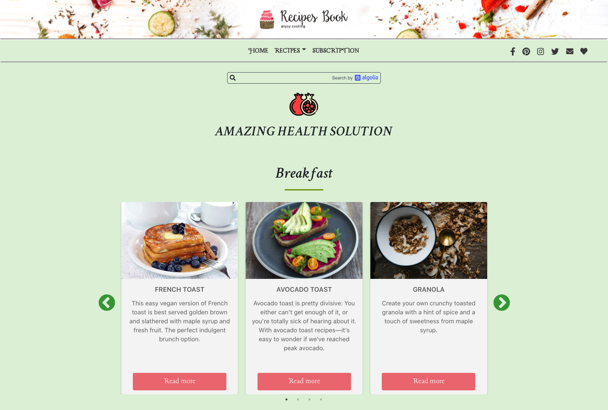

# Recipe Book

A full-stack web application letting the user discover delicious vegetarian recipes

## Frontend built with 

- React.js, JavaScript
- Algolia Search
- HTML, CSS, Bootstrap

Repository: [github.com/ansocab/recipe-book](https://github.com/ansocab/recipe-book)

## Backend built with

- Express.js / Node.js
- PostgreSQL / ElephantSQL

Repostiory: [github.com/lidiyacheb/recipe-book-api](https://github.com/lidiyacheb/recipe-book-api)

## Live Demo

https://our-cookbook.netlify.app/

## Team

- [Lidia Chebotarova](https://github.com/lidiyacheb)
- [Ana Caballero](https://github.com/ansocab)
